<h1 align="center">BTG Funds</h1>

<p align="center">
Simulación de gestión de fondos de inversión (FPV/FIC) desarrollada como prueba técnica para Ingeniero Front-End.
</p>

<p align="center">
  
  
  
  
  
  
  
</p>

<br>

<p align="center">
  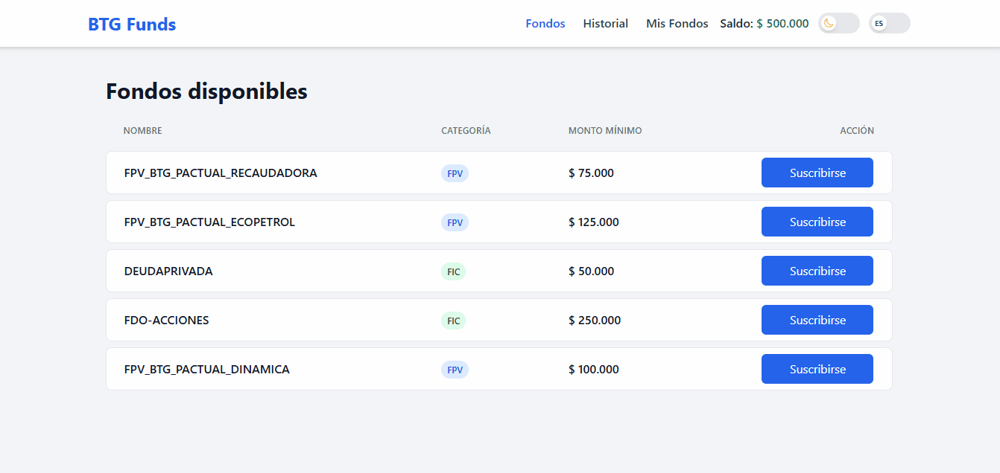
</p>

<br>

---

## ✨ Features

- 📊 Visualización de fondos disponibles (FPV / FIC)
- 💰 Suscripción a fondos con validación de monto mínimo
- 🔄 Cancelación de participación en fondos
- 🧾 Historial de transacciones
- 🔔 Selección de método de notificación
- 🌗 Modo Dark / Light
- 🌍 Internacionalización (ES / EN)
- 📱 UI responsive para desktop y mobile
- 🧪 Tests unitarios con Jasmine y Karma

---

## 🚀 Instalación

### Clonar repositorio

```bash
git clone https://github.com/Dpalacioo/btg-funds.git
cd btg-funds
```

### Instalar dependencias

```bash
npm install
```

### Ejecutar API mock

```bash
npx json-server --watch mock-api/db.json --port 3000
```

### Ejecutar aplicación

```bash
ng serve
```

Abrir en navegador:

```
http://localhost:4200
```

---

## 📑 Tabla de Contenido

|                                                           |                                                                     |
| --------------------------------------------------------- | ------------------------------------------------------------------- |
| [📋 Información General](#-información-general)           | [🎯 Funcionalidades Implementadas](#-funcionalidades-implementadas) |
| [🧠 Descripción del Proyecto](#-descripción-del-proyecto) | [💰 Fondos Disponibles](#-fondos-disponibles)                       |
| [⚙️ Stack Tecnológico](#-stack-tecnológico)               | [🧩 Arquitectura del Proyecto](#-arquitectura-del-proyecto)         |
| [🎨 Paleta de Colores](#-paleta-de-colores)               | [🔄 Flujo de la Aplicación](#-flujo-de-la-aplicación)               |
| [📱 Pantallas Implementadas](#-pantallas-implementadas)   |                                                                     |
| [🎨 Características UI/UX](#-características-uiux)        |                                                                     |
| [📱 Capturas de Pantalla](#-capturas-de-pantalla)         |                                                                     |
| [📊 Consideraciones Técnicas](#-consideraciones-técnicas) |                                                                     |
| [👨‍💻 Autor](#-autor)                                       |                                                                     |
| [📌 Notas para Evaluadores](#-notas-para-evaluadores)     |                                                                     |
| [⭐ Conclusión](#-conclusión)                             |                                                                     |

---

# 📋 Información General

| Campo                | Detalle                     |
| -------------------- | --------------------------- |
| Nombre               | BTG Funds                   |
| Framework            | Angular 18                  |
| Arquitectura         | NgModules                   |
| Estilos              | TailwindCSS                 |
| API                  | json-server (mock REST API) |
| Internacionalización | ngx-translate               |
| Testing              | Karma + Jasmine             |
| Estado               | ✅ Funcional                |
| Desarrollador        | Daniel Palacio              |

---

# 🧠 Descripción del Proyecto

Aplicación web desarrollada en **Angular** que permite simular la gestión de **fondos de inversión (FPV/FIC)** para clientes de **BTG Pactual**.

El usuario puede:

- visualizar fondos disponibles
- suscribirse a fondos si cumple el monto mínimo
- cancelar su participación en fondos activos
- visualizar historial de transacciones
- seleccionar método de notificación
- ver saldo actualizado en tiempo real

La aplicación fue desarrollada utilizando:

- arquitectura modular
- programación reactiva con RxJS
- UI moderna y responsive con TailwindCSS

---

# ⚙️ Stack Tecnológico

| Tecnología    | Versión | Uso                         |
| ------------- | ------- | --------------------------- |
| Angular       | 18      | Framework SPA               |
| TypeScript    | 5       | Tipado estático             |
| RxJS          | 7       | Manejo reactivo del estado  |
| TailwindCSS   | 3       | Estilos y layout responsive |
| ngx-translate | 17      | Internacionalización        |
| json-server   | latest  | API mock                    |
| Karma         | 6       | Test runner                 |
| Jasmine       | 5       | Testing framework           |

---

# 🎨 Paleta de Colores

| Variable  | Uso                   |
| --------- | --------------------- |
| Blue      | Acciones principales  |
| Green     | Saldo positivo        |
| Red       | Cancelación de fondos |
| Gray      | Layout base           |
| Dark Gray | Dark mode             |

---

# 📱 Pantallas Implementadas

| Pantalla           | Ruta            | Descripción                         |
| ------------------ | --------------- | ----------------------------------- |
| Fondos disponibles | `/funds`        | Visualización de fondos disponibles |
| Mis fondos         | `/my-funds`     | Mis fondos o Suscripciones          |
| Historial          | `/transactions` | Historial de transacciones          |

---

# 🎨 Características UI/UX

| Característica      | Descripción                                     |
| ------------------- | ----------------------------------------------- |
| Responsive design   | Adaptación completa a desktop y mobile          |
| Dark / Light Mode   | Cambio de tema con persistencia en localStorage |
| Toast notifications | Feedback visual para acciones del usuario       |
| Confirm modals      | Confirmación para suscripciones y cancelaciones |
| Loading states      | Indicador visual durante operaciones            |
| Empty states        | Mensajes cuando no hay datos                    |
| Grid moderno        | Layout tipo dashboard financiero                |
| Badges visuales     | Identificación clara de categorías FPV / FIC    |
| Selector de idioma  | Español / Inglés                                |

---

# 🎯 Funcionalidades Implementadas

| Funcionalidad                       | Estado |
| ----------------------------------- | ------ |
| Visualización de fondos disponibles | ✅     |
| Suscripción a fondos                | ✅     |
| Validación de monto mínimo          | ✅     |
| Cancelación de participación        | ✅     |
| Actualización de saldo              | ✅     |
| Historial de transacciones          | ✅     |
| Selección método de notificación    | ✅     |
| Validación de formulario            | ✅     |
| Manejo de errores                   | ✅     |
| Toast notifications                 | ✅     |
| Confirm modals                      | ✅     |
| Responsive UI                       | ✅     |
| Dark / Light mode                   | ✅     |
| Internacionalización                | ✅     |

---

# 💰 Fondos Disponibles

| ID  | Nombre                      | Monto mínimo | Categoría |
| --- | --------------------------- | ------------ | --------- |
| 1   | FPV_BTG_PACTUAL_RECAUDADORA | COP $75.000  | FPV       |
| 2   | FPV_BTG_PACTUAL_ECOPETROL   | COP $125.000 | FPV       |
| 3   | DEUDAPRIVADA                | COP $50.000  | FIC       |
| 4   | FDO-ACCIONES                | COP $250.000 | FIC       |
| 5   | FPV_BTG_PACTUAL_DINAMICA    | COP $100.000 | FPV       |

---

# 🧩 Arquitectura del Proyecto

La aplicación sigue una **arquitectura feature-based**, separando responsabilidades entre módulos, servicios y componentes.

```
src/
 ├── app/
 │   ├── core/
 │   │   ├── models
 │   │   └── services
 │   │
 │   ├── features/
 │   │   ├── funds
 │   │   └── transactions
 │   │
 │   ├── shared/
 │   │   └── components
 │   │
 │   ├── app-routing.module.ts
 │   ├── app.component.ts
 │   └── app.module.ts
 │
 ├── assets
 └── environments
```

---

# 🔄 Flujo de la Aplicación

```
Usuario
   │
   ▼
Componentes UI
   │
   ▼
Servicios Angular
   │
   ▼
Estado reactivo (RxJS)
   │
   ▼
Mock API (json-server)
```

---

# 📱 Capturas de Pantalla

---

# 📱 Mobile (App)

## Fondos disponibles

| Light Mode (ES)                                                                          | Dark Mode (EN)                                                                          |
| ---------------------------------------------------------------------------------------- | --------------------------------------------------------------------------------------- |
| <p align="center">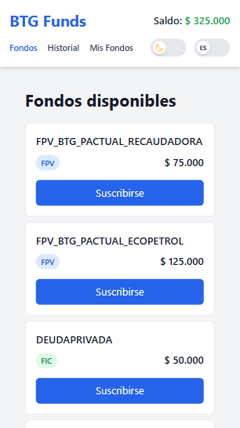</p> | <p align="center">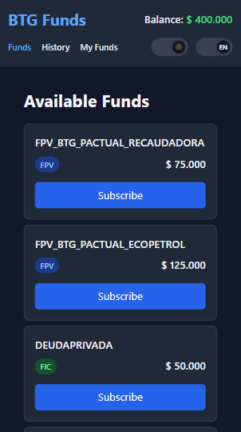</p> |

---

## Mis fondos

| Light Mode (ES)                                                                                    | Dark Mode (EN)                                                                                    |
| -------------------------------------------------------------------------------------------------- | ------------------------------------------------------------------------------------------------- |
| <p align="center">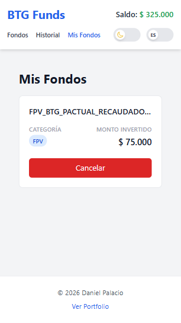</p> | <p align="center">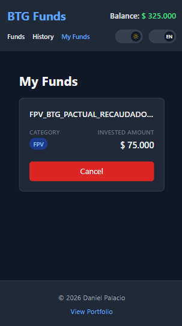</p> |

---

## Historial de transacciones

| Light Mode (ES)                                                                            | Dark Mode (EN)                                                                            |
| ------------------------------------------------------------------------------------------ | ----------------------------------------------------------------------------------------- |
| <p align="center">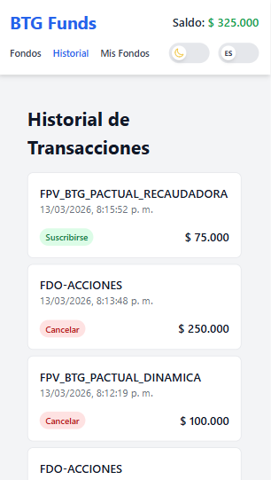</p> | <p align="center">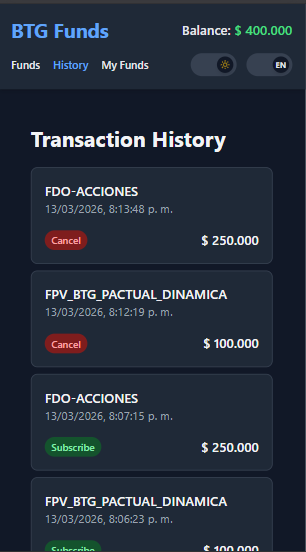</p> |

---

# 💻 Desktop / Responsive

## Fondos disponibles

| Light Mode (ES)                                                                    | Dark Mode (EN)                                                                    |
| ---------------------------------------------------------------------------------- | --------------------------------------------------------------------------------- |
| <p align="center"></p> | <p align="center">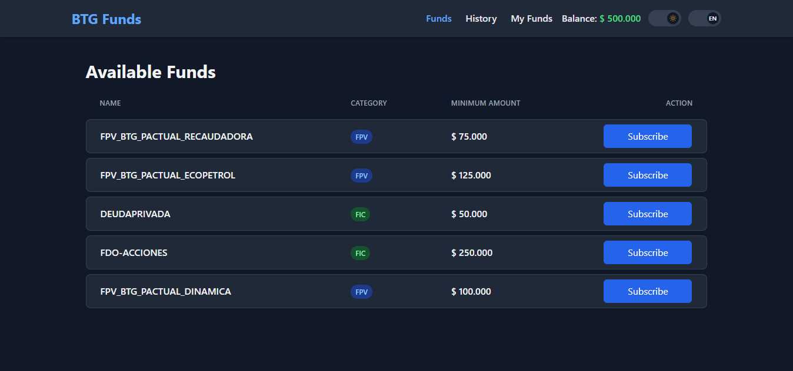</p> |

---

## Mis fondos

| Light Mode (ES)                                                                              | Dark Mode (EN)                                                                              |
| -------------------------------------------------------------------------------------------- | ------------------------------------------------------------------------------------------- |
| <p align="center">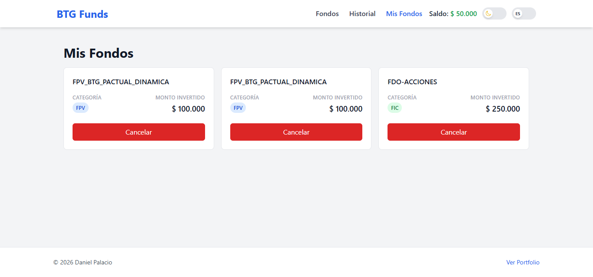</p> | <p align="center">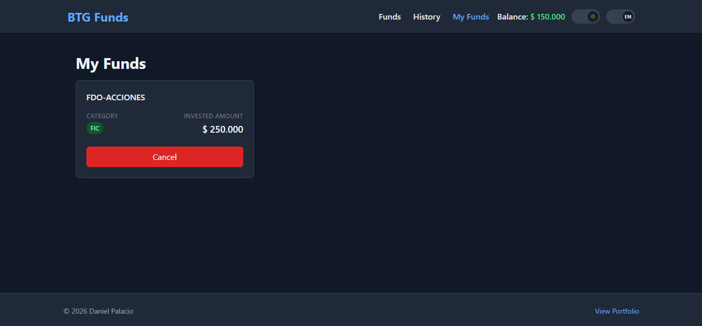</p> |

---

## Cancelación de suscripción

| Light Mode (ES)                                                                                     | Dark Mode (EN)                                                                                     |
| --------------------------------------------------------------------------------------------------- | -------------------------------------------------------------------------------------------------- |
| <p align="center">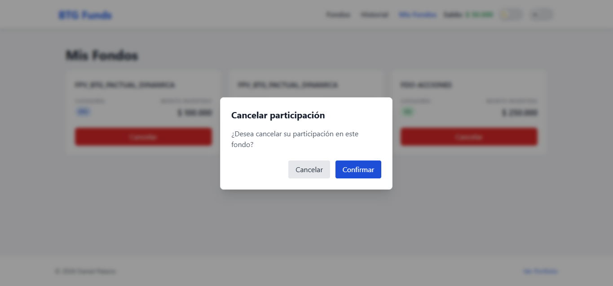</p> | <p align="center">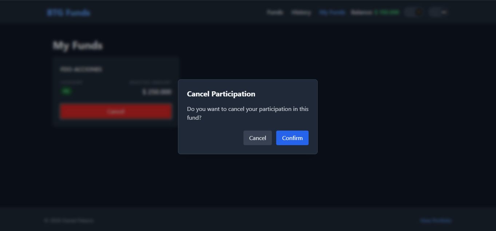</p> |

---

## Historial de transacciones

| Light Mode (ES)                                                                      | Dark Mode (EN)                                                                      |
| ------------------------------------------------------------------------------------ | ----------------------------------------------------------------------------------- |
| <p align="center">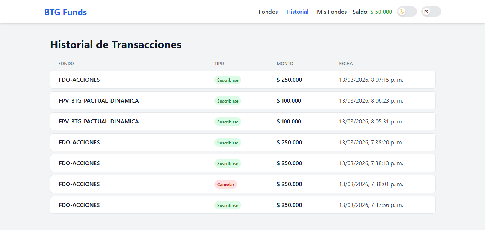</p> | <p align="center">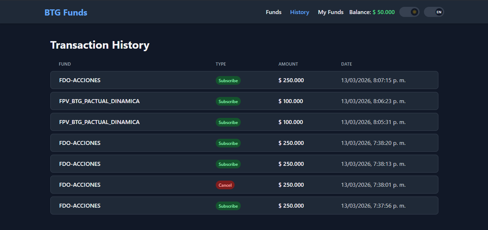</p> |

---

## Modal de confirmación

| Light Mode (ES)                                                                            | Dark Mode (EN)                                                                            |
| ------------------------------------------------------------------------------------------ | ----------------------------------------------------------------------------------------- |
| <p align="center">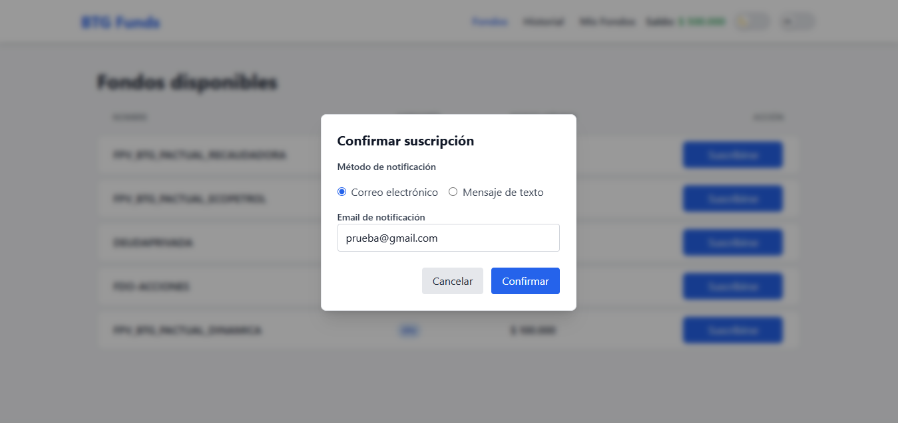</p> | <p align="center">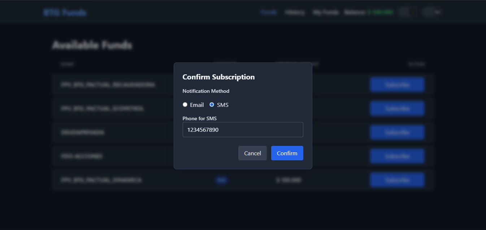</p> |

---

## Confirmación exitosa

| Light Mode (ES)                                                                                    | Dark Mode (EN)                                                                                    |
| -------------------------------------------------------------------------------------------------- | ------------------------------------------------------------------------------------------------- |
| <p align="center">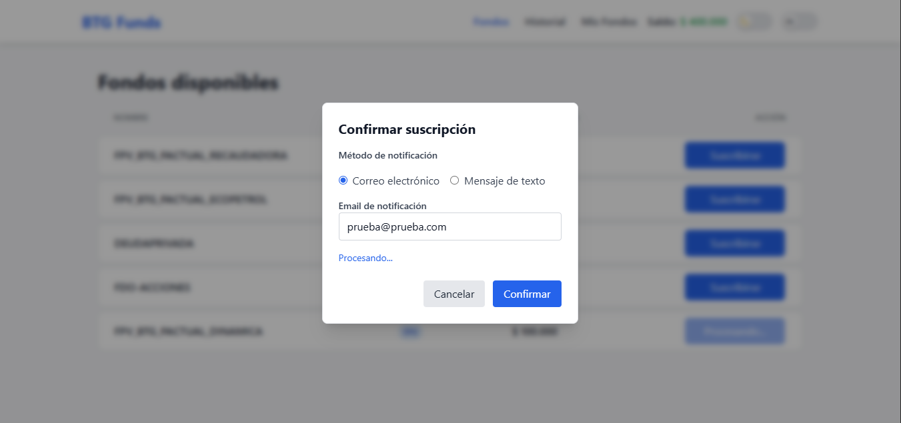</p> | <p align="center">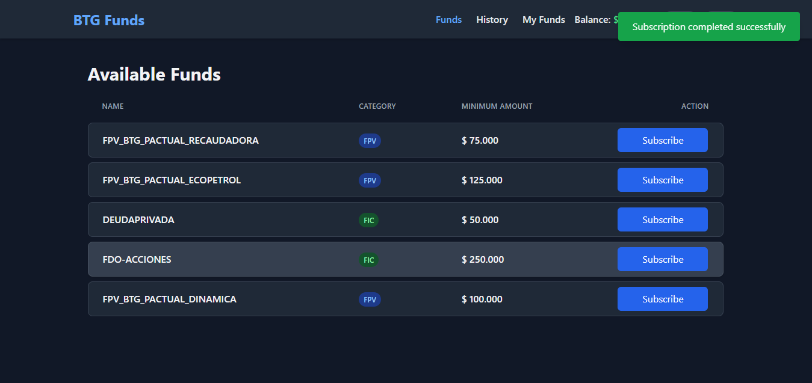</p> |

---

## Error en confirmación

| Light Mode (ES)                                                                                  | Dark Mode (EN)                                                                                  |
| ------------------------------------------------------------------------------------------------ | ----------------------------------------------------------------------------------------------- |
| <p align="center">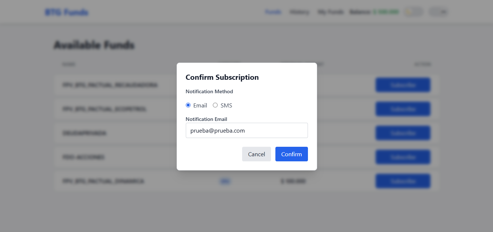</p> | <p align="center">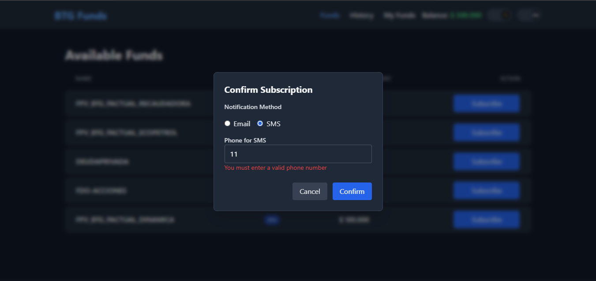</p> |

---

## Error: saldo insuficiente

| Light Mode (ES)                                                                                           | Dark Mode (EN)                                                                                           |
| --------------------------------------------------------------------------------------------------------- | -------------------------------------------------------------------------------------------------------- |
| <p align="center">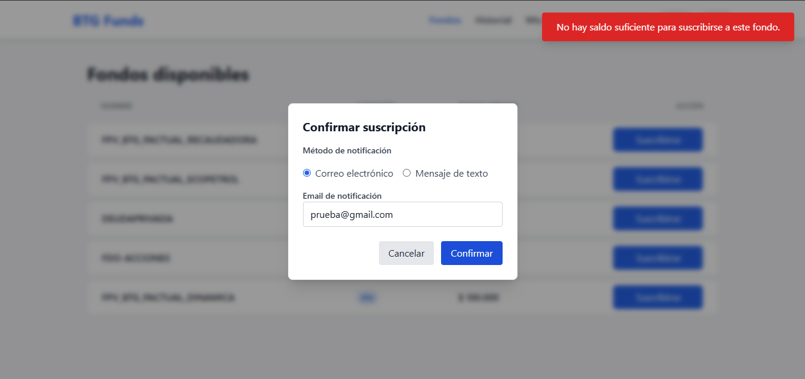</p> | <p align="center">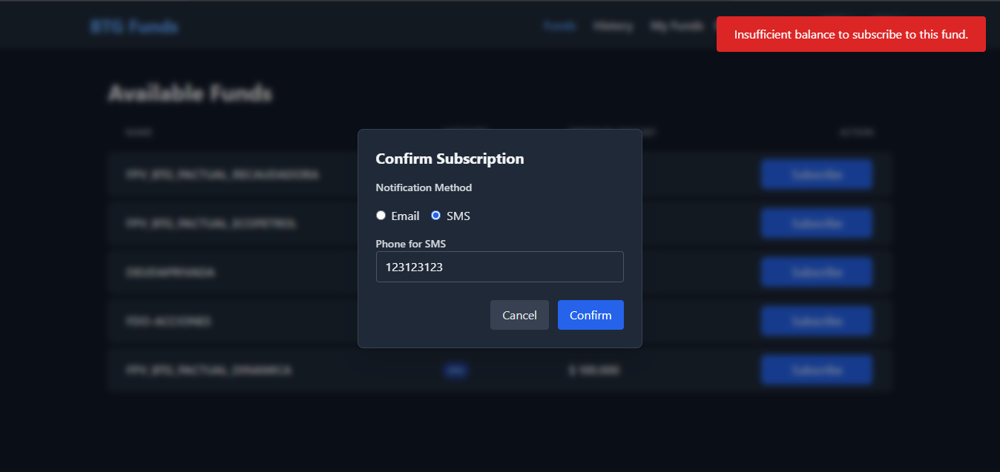</p> |

---

# 🧪 Test Unitarios

<p align="center">
  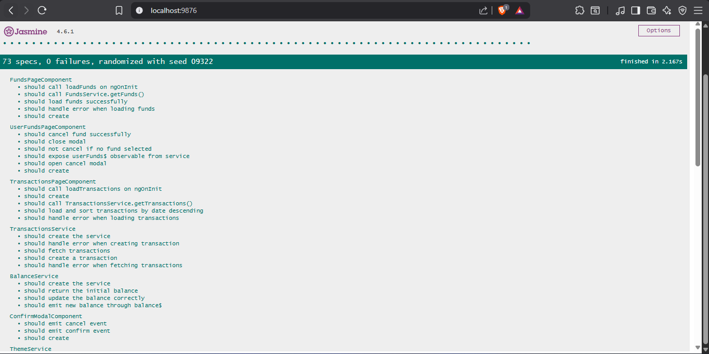
</p>

<p align="center">
  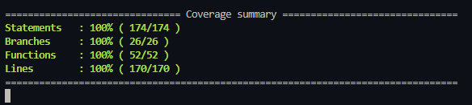
</p>

<p align="center">
  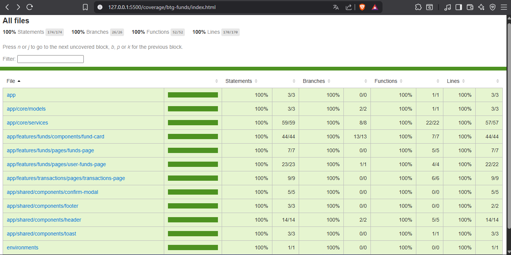
</p>

---

# 📊 Consideraciones Técnicas

- Usuario único con saldo inicial **COP $500.000**
- No se implementa backend real
- API simulada con **json-server**
- Estado manejado con **RxJS**
- Arquitectura preparada para escalabilidad futura

---

# 👨‍💻 Autor

**Daniel Palacio**

Frontend Developer

---

# 📌 Notas para Evaluadores

Este proyecto fue desarrollado como parte de una **prueba técnica para BTG Pactual**.

El enfoque principal fue:

- arquitectura modular escalable
- buenas prácticas de Angular
- manejo reactivo del estado con RxJS
- experiencia de usuario clara
- código limpio y mantenible

---

# ⭐ Conclusión

La aplicación implementa todos los requerimientos de la prueba técnica utilizando:

- arquitectura modular
- estado reactivo
- UI moderna
- buenas prácticas de Angular
- experiencia de usuario clara y responsiva
